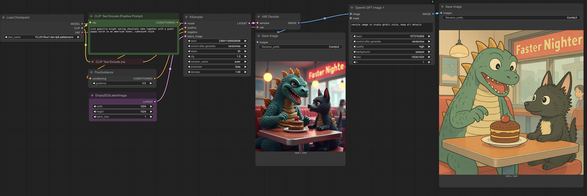

# ComfyUI: FLUX.1 Dev + OpenAI GPT-Image 1

In this video we show how to use FLUX.1-dev in combination with OpenAI GPT-Image 1 in ComfyUI running on a RTX 5090 on RunPod.

---

## Usage

You can load the workflow in multiple ways:

- Drag & drop the `flux-gpt-image-1.json` workflow into your ComfyUI
- Use the menu:
  - `Workflow > Open`
  - Select the `flux-gpt-image-1.json` workflow
  - Click on "Open"

Then you should see a workflow like this:

