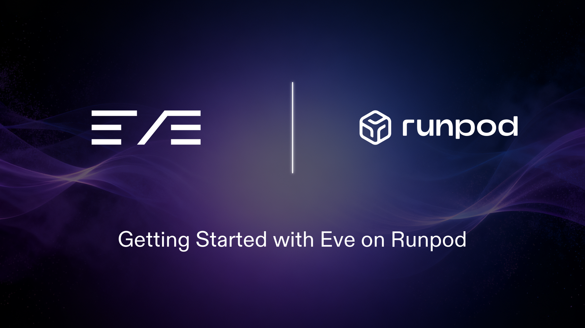

# Getting Started with Eve on Runpod

An image-generating AI agent built with [**Eve**](https://www.npmjs.com/package/eve)
whose brain is an open LLM you self-host on Runpod Serverless
(`Qwen/Qwen3.6-27B-FP8` on vLLM), with a `generate_image` tool and a Next.js web
chat UI.

```
Browser ─ Next.js chat UI ─ Eve agent
                              ├─ brain: Qwen3.6-27B-FP8 (Runpod Serverless, vLLM)
                              └─ tool:  generate_image → Runpod image model
```

## Prerequisites

- A [Runpod account](https://runpod.io) + [API key](https://console.runpod.io/user/settings) with credits.
- [Node 24](https://nodejs.org) and [`runpodctl`](https://github.com/runpod/runpodctl) **v2.6.0+**.

## 1. Install

```bash
npm install
cp .env.example .env.local
```

## 2. Deploy the LLM brain

Deploy the model on Runpod Serverless with [worker-vllm](https://github.com/runpod-workers/worker-vllm).
`--model-reference` caches the model in the datacenter's Hugging Face cache, so
it's downloaded once and loaded from cache on later cold starts.

```bash
runpodctl serverless create \
  --hub-id cm8h09d9n000008jvh2rqdsmb \
  --name eve-qwen36 \
  --gpu-id "ADA_48_PRO" \
  --workers-min 0 --workers-max 1 --idle-timeout 300 \
  --model-reference https://huggingface.co/Qwen/Qwen3.6-27B-FP8:main \
  --env MODEL_NAME=Qwen/Qwen3.6-27B-FP8 \
  --env OPENAI_SERVED_MODEL_NAME_OVERRIDE=Qwen/Qwen3.6-27B-FP8 \
  --env MAX_MODEL_LEN=32768 \
  --env GPU_MEMORY_UTILIZATION=0.90 \
  --env ENABLE_AUTO_TOOL_CHOICE=true \
  --env TOOL_CALL_PARSER=qwen3_xml \
  --env REASONING_PARSER=qwen3
```

The `OPENAI_SERVED_MODEL_NAME_OVERRIDE` is required: with a cached model,
worker-vllm otherwise serves it under its on-disk snapshot path rather than
`MODEL_NAME`, and every request would 404 (see
[worker-vllm#310](https://github.com/runpod-workers/worker-vllm/issues/310)).
The override pins the served name to `Qwen/Qwen3.6-27B-FP8`.

Verify the endpoint serves under that name (it cold-starts on first call, ~2–5 min):

```bash
curl -s -H "Authorization: Bearer $RUNPOD_API_KEY" \
  https://api.runpod.ai/v2/<endpoint-id>/openai/v1/models
# the returned "id" should be exactly Qwen/Qwen3.6-27B-FP8
```

Copy the returned endpoint `id` into `.env.local`, and add your API key:

```
RUNPOD_API_KEY=...            # from the Runpod console
RUNPOD_LLM_ENDPOINT_ID=...    # the id printed above
```

`Qwen3.6` is the latest Qwen generation; `qwen3_xml` is the matching vLLM
tool-call parser. The FP8 build (~27 GB) fits any GPU with ≥40 GB
(`ADA_48_PRO`, `AMPERE_48`, `AMPERE_80`, …).

## 3. Run

```bash
npm run dev
```

Open <http://localhost:3000> and ask for an image (e.g. *"draw a fox astronaut"*).
The agent reasons on your self-hosted LLM, calls `generate_image`, and renders the
result inline. The first request after the endpoint is idle cold-starts the worker
(then it stays warm for 5 minutes).

## What's in here

```
agent/
  agent.ts                  # brain = your endpoint via @runpod/ai-sdk-provider
  instructions.md           # system prompt
  tools/generate_image.ts   # Runpod image generation → public/generated/*.jpeg
  channels/eve.ts           # web channel
app/, components/, lib/     # Next.js chat UI (from `eve channels add web`)
.env.example                # environment template
```

## Notes

- The UI, chat components, and tool are real source — edit them freely.
- Generated images are written to `public/generated/` and served by Next.js. For a
  Vercel deploy (read-only filesystem), serve them from object storage instead.
- The agent config uses `modelContextWindowTokens` (in `agent/agent.ts`) because
  Eve can't look up the context window for a self-hosted model automatically.
